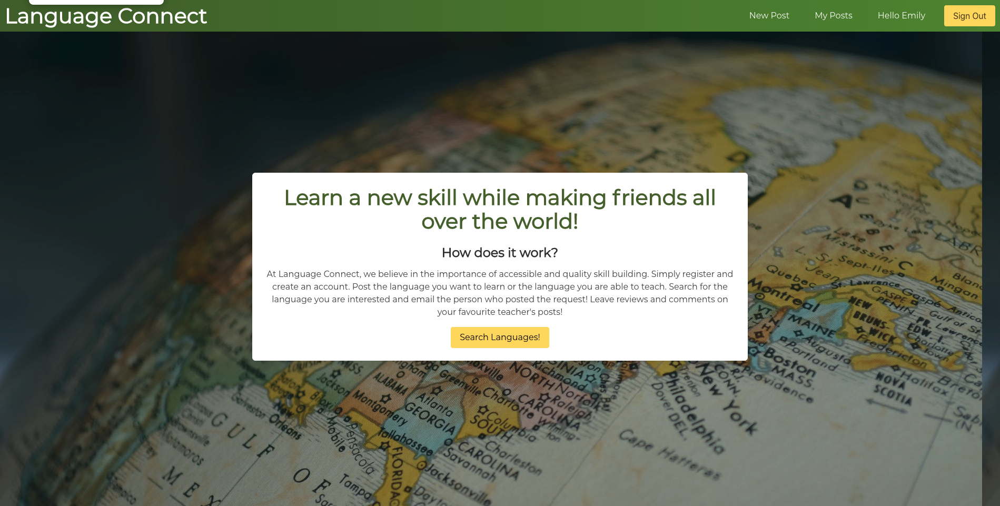
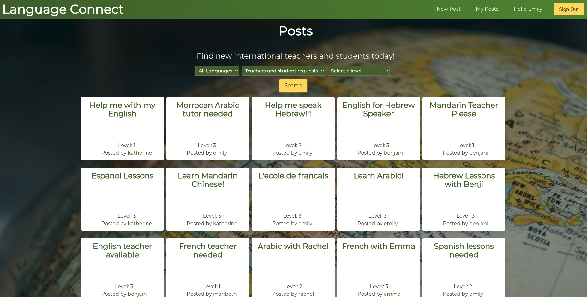
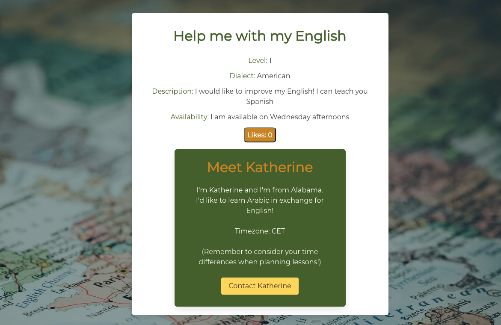
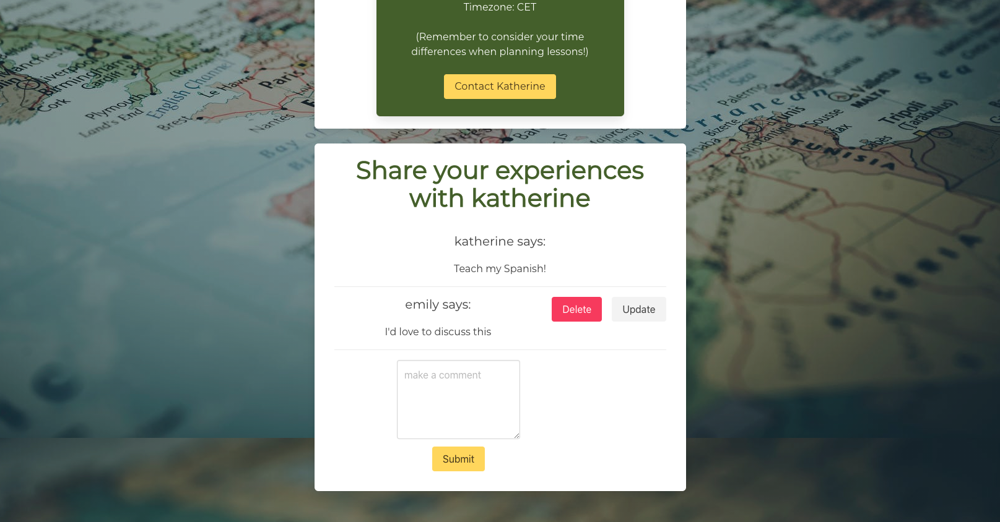
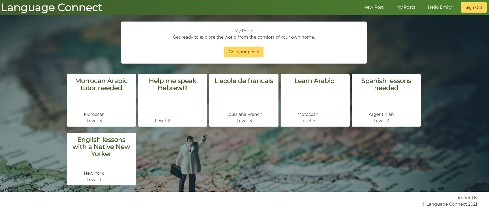
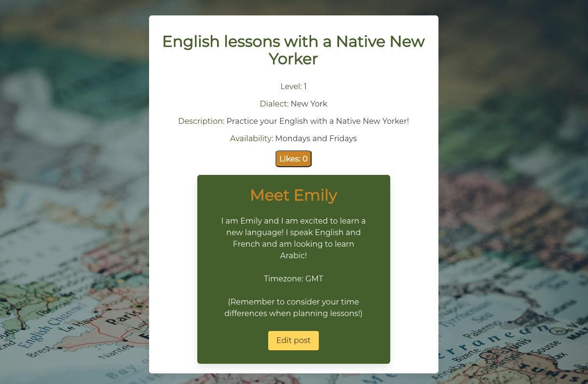
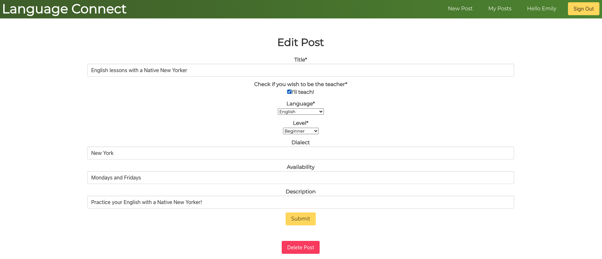
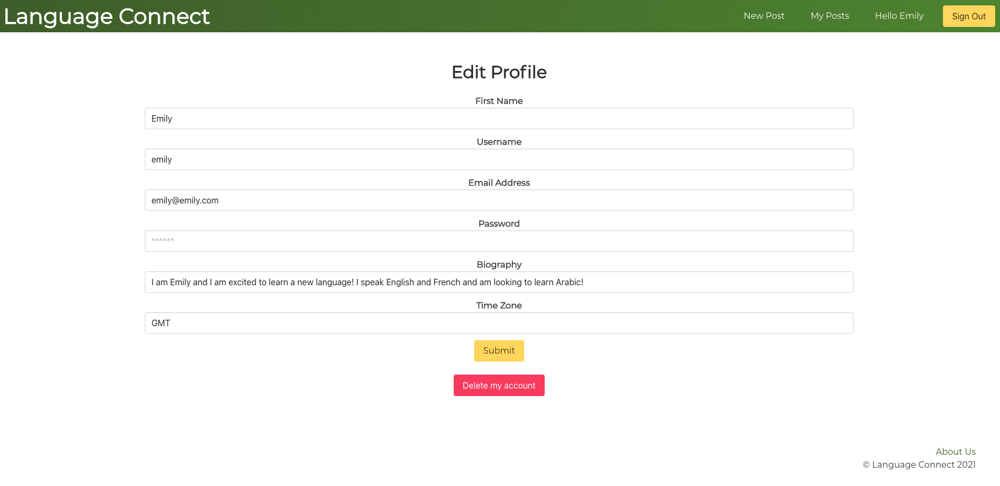

###  General Assembly, Software Engineering Immersive


# Language Connect

For Project 4, my group decided to create a language swap service, where users can post languages they wish to teach or learn and connect with other users on the platform. I primarily took a leading role on this project, contributing to the controllers on the back end as well as design lead on the front end. 

The project is deployed on Heroku which can be viewed here: https://language-connect.herokuapp.com/

You can log in and create an account, however, you may also use this log in to view the site as an established user:

*email*: emily@emily.com
*password*: emily

## Technologies Used
- HTML
- CSS
- React
- Bulma
- Flask
- PostgreSQL
- Marshmallow
- Npm
- Pipenv
- Axios
- Insomnia
- Table Plus
- Formik
- Git
- Github

## Technical Requirements
* **Build a full-stack application** by making your own backend and your own front-end
* **Use a Python Flask API** using a Flask REST Framework to serve your data from a Postgres database
* **Consume your API with a separate front-end** built with React
* **Be a complete product** which most likely means multiple relationships and CRUD functionality for at least a couple of models
* **Implement thoughtful user stories/wireframes** that are significant enough to help you know which features are core MVP and which you can cut
* **Have a visually impressive design** to kick your portfolio up a notch and have something to wow future clients & employers. **ALLOW** time for this.
* **Be deployed online** so it's publicly accessible.

## Timeframe: 1 week (5 working days)

## Screenshots

Homepage


Search page to see all mapped posts


Post page


Post Comments


My Posts page


Post page from the Owners perspective


Update Posts page


Update User Page

## Plan
Originally, we wanted to create a skills swap website, but due to the limited time, we decided to focus on one skill, languages, and focus on the sub categories within that skill. WE created a mock up of how we wanted our tables to look, with most information linking back to either the Users or Posts table. 
## Database and Backend
The backend was the most complex part of the project. While our initial plan gave us a good base for creating the back end and the database, there were definitely issues that arose that had us change the plan.

Originally, we intended on having many skills available but to make sure we had a completed MVP, we decided to focus on language learning. 

After having some issues with populating the database, we decided to move to a one to many model with the posts. This made the most sense since the users would only have one post per language. 

For the controllers, we decided to have multiple endpoints for users to get relevant information. For our site, the main points users would be searching would be posts and languages. To accomplish this we created two different endpoints for getting all posts and getting posts by language.

```python
@router.route("/posts/language/<int:query_language_id>", methods=["GET"])
def get_posts_by_language(query_language_id):
    post = Post.query.all()
    lang_post = []
    for x in post:
        if x.language_id == query_language_id:
            print(x.language_id)
            lang_post.append(x)
            print(lang_post)    
    return post_schema.jsonify(lang_post, many=True), 200

@router.route("/posts", methods=["GET"])
def get_posts():
    posts = Post.query.all()
    return post_schema.jsonify(posts, many=True), 200


@router.route("/posts/<int:post_id>", methods=["GET"])
def get_single_post(post_id):
    post = Post.query.get(post_id)
    
    if not post:
        return {"message": "Post not found"}, 404

    return post_schema.jsonify(post), 200

```
For the SQL tables, they often connect with ids. This has the id number of the user, language or post linking the item back to another table. This gave us 4 tables, Language, Users, Posts, and Comments. 

## Front End Design and Components
As design lead, my focus on the front end primarily focused on the overall design of the site, as well as formatting the Search, Post, and My Posts pages.

Having used Bulma on previous projects, I had never take the lead myself and found this project a good opportunity to get better acquainted with this design library.

We chose a green and gold color scheme and found royalty free globe images to give the site a worldly and global feel. While the *Home* page uses the standard hero home template from Bulma, we wanted our other pages to look Bulma inspired with our own unique twists. 

For the *Search* page, we decided to utilize front end filtering with backend endpoints to display the relevant posts. To prevent an infinite loop, where the useEffect was continuously fetching, I chose to have the user select which filters they would like to use then on click of the Search button, the relevant posts are displayed. 

Filtering of students/teachers and the level
```js
useEffect(() => {
    async function fetchPosts() {
      try {
        const { data } = await axios.get(apiUrl)
        updatePosts(data)
        updateLoading(false)
      } catch (err) {
        console.log(err)
      }
    }
    fetchPosts()
  }, [apiUrl])
  function getStudents(level) {
    const filteredLevel = []
    const filteredPosts = posts.filter(student => student.is_offer !== true)
    if (level !== 0) {
      for (let i = 0; i < filteredPosts.length; i++) {
        if (parseInt(filteredPosts[i].level) === level) {
          filteredLevel.push(filteredPosts[i])
        }
      }
      return filteredLevel
    }
    return filteredPosts
  }
  function getTeachers(level) {
    const filteredLevel = []
    const filteredPosts = posts.filter(student => student.is_offer === true)
    if (level !== 0) {
      for (let i = 0; i < filteredPosts.length; i++) {
        if (parseInt(filteredPosts[i].level) === level) {
          filteredLevel.push(filteredPosts[i])
        }
      }
      return filteredLevel
    }
    return filteredPosts
  }
  function getAllPostsByLevel(level) {
    const filteredLevel = []
    if (level !== 0) {
      for (let i = 0; i < posts.length; i++) {
        if (parseInt(posts[i].level) === level) {
          filteredLevel.push(posts[i])
        }
      }
      return filteredLevel
    }
    return posts
  }
  if (loading) {
    return <>
      <h1>Loading posts...</h1>
    </>
  }
  function filtering(tof, level) {
    if (tof === 'teachers') {
      setOption(getTeachers(level))
    } else if (tof === 'students') {
      setOption(getStudents(level))
    } else {
      setOption(getAllPostsByLevel(level))
    }
  }
```


HTML Rendering of the filters
```js
<div className='columns is-mobile is-centered'>
      <select className='dropdown is-hoverable is-centered mr-1 brandfont' id='dropdown-menu' onChange={(event) => {
        setApiUrl(`${event.target.value}`)
      }}>
        <option value='/api/posts'>All Languages</option>
        <option value='/api/posts/language/1'>English</option>
        <option value='/api/posts/language/2'>Spanish</option>
        <option value='/api/posts/language/3'>French</option>
        <option value='/api/posts/language/4'>Arabic</option>
        <option value='/api/posts/language/5'>Mandarin</option>
        <option value='/api/posts/language/6'>Hebrew</option>
      </select>
      <select className='dropdown is-hoverable is-centered ml-1 mr-1 brandfont' id='dropdown-menu' onChange={(e) => {
        setTof(e.target.value)
      }}>
        <option value='all'>Teachers and student requests</option>
        <option value='teachers'>Looking for Teacher</option>
        <option value='students'>Looking for a student</option>
      </select>
      <select className='dropdown is-hoverable is-centered mr-1 ml-1 brandfont' id='dropdown-menu' onChange={(event) => {
        updateLevel(parseInt(event.target.value))
      }}>
        <option value="0">Select a level</option>
        <option value="1">Beginner (Level 1)</option>
        <option value="2">Intermediate (Level 2)</option>
        <option value="3">Advanced (Level 3)</option>
      </select>
    </div>
```

For filtering the languages, we started with the endpoints designed to bring up posts showing each relevant language. When creating our user stories, we figured that users would search first by language, so it made sense to start the filtering from there.

From this point, we then added in front end filtering to let users decide if they were looking for a student or teacher as well as what level they wanted to learn at. This will filter from either the all posts or language specific endpoints.

We used flexbox to wrap the cards with each lesson on them. The Card itself links to each individual post page. Resuls were mapped onto the page, then wrapped to create a grid.

```js
<div className='container'>
      {option.map((post) => {
        return <Link key={post.id} to={`/post/${post.id}`}>
          <div className="card rows mt-4 p-3">
            <div><h2 className='title is-size-4 brandfont has-text-centered' id='olive-green-text'>{post.title}</h2></div>
            <div className='is-centered' id="card-info">
              <h4 className='brandfont has-text-centered'>Level: {post.level}</h4>
              <h5 className='brandfont has-text-centered card-info'>Posted by <span id='olive-green-text'>{post.user.username}</span></h5>
            </div>
          </div>
        </Link>
      })
      }
    </ div>
```

The Single Post page displays the information for each lesson with comments for users to review or ask questions. 

We decided as a group not to include a messaging system due to limited time but we wanted a simple way for users to messgae with potential students and teachers. To do this we included a 'mailto' link. 

For the forms, our team decided to use Formik. While another teammate created the base for the forms, I worked on the update and delete posts for users and posts. This intially presented a challenge as I was unsure of how to changes the forms to pre populate with the correct data. After reading the documentation, I used useData to get formData and updateFormData.

```js
function UpdatePost({ history, match }) {
  const token = localStorage.getItem('token')
  const [error, updateError] = useState('')
  const [formSuccess, updateFormSuccess] = useState(false)
  const [errorState, updateErrorState] = useState(false)
  const id = match.params.post_id
  const [ownerId, updateOwnerId] = useState('')
  const [formData, updateFormData] = useState({
    title: '',
    level: '',
    dialect: '',
    is_offer: false,
    availability: '',
    description: '',
    language_id: ''
  })
const [post, setPost] = useState({})

  useEffect(() => {
    axios.get(`/api/posts/${id}`)
      .then(({ data }) => {
        updateOwnerId(data.user.id)
        const newFormData = {
          title: data['title'],
          level: data['level'],
          dialect: data['dialect'],
          is_offer: data['is_offer'],
          availability: data['availability'],
          description: data['description'],
          language_id: data['language_id']
        }
        updateFormData(newFormData)
        setPost(data)
      })

  }, [])


  function handleChange(event) {
    const { name, value } = event.target
    updateFormData({ ...formData, [name]: value })
  }


  ....

onSubmit={async (values, { setSubmitting }) => {
          const token = localStorage.getItem('token')

          try {const { data } = await axios.put(`/api/posts/${id}`, {
            title: values.title,
            level: values.level,
            dialect: values.dialect,
            is_offer: values.is_offer,
            availability: values.availability,
            description: values.description,
            language_id: values.language_id

          },
          {
            headers: { Authorization: `Bearer ${token}` }
          })

          history.push('/search')

          console.log(values, 'woooooo')

          setTimeout(() => {
            // alert(JSON.stringify(values, null, 2))
            setSubmitting(false)
          }, 400)
        }  catch (err) {
          
          updateError('Unable to update post. Please enter a value for all required fields.')
          console.log(err)
        }
        }}
```
At end of the project, I wanted to get some experience with classical components, which led me to add in the *Like Counter* button. While we did not have the time to add it to a table in the back end, it added an additional feature on the front end, The number of 'likes' increases each time the user clicks it.

```js
import React, { Component } from 'react'


class LikeButton extends Component {
  constructor() {
    super();

  {this.state = {
    count: 0
  }}
  this.incrementMe = this.incrementMe.bind(this);
  }
  incrementMe() {
    let newCount = this.state.count + 1
    this.setState({
      count: newCount
    })
  }

  render() {
    

    return (
      <div>
        <button id='gold-button' onClick={this.incrementMe}>
          Likes: {this.state.count}
        </button>
       
      </div>
    )
  }
}

export default LikeButton;

```
## Bugs
- Some of the Formik validations do not run when missing required fields. 

## Wins and Challenges
### Wins
- Creating a PostgreSQL database with python controllers that successfully show the correct information on the front pages.
- Taking on the role of Design Lead and customising a Bulma based style sheet
- Adding in some frontend filtering on the front page that works with the Get All Posts endpoint and the Get Posts by Language endpoint. 

### Challenges
- We really struggled with the creation of the tables and trying to implement so additional many to many tables. We realised that this was not neccesary for what we were looking to display on the front end so we redid our models and the correct id's the the relationalships successfully displayed on Table Plus.
- While the posting formik forms worked alright, we noticed that the updating forms were not correctly displaying the updated information. To solve this, I moved over to working on the Formik sheets and was able to find the correct variable to add into the function to display the updated information. 

## Lessons Learned
I believe my group and I found this experience enjoyable. I particularly was proud of the confidence I felt taking on the project lead role. Looking back, I do wish we had more time to flesh out some of the components we were not able to add, such as the saved posts or the translation features. This is something I plan to work on after the course as I look for my first professional role. 

While working with Python was definitely a challenge, I enjoyed using a new language and would like to continue working on my python skills. Having previous experience with SQL, I enjoyed being able to use it in one of my GA projects. 

SQL databases were a lot different then the NoSQL database I worked on in project 3. I found to process of designing new models with multiple tables very interesting and showed me new ways that data can connect to each other. 

*Challenges*
- Adjusting our models to our needs and changing plan
- Front end filtering for the search feature
- Editing the Formik forms to pre-populate data and update the boolean (teacher vs student) so it correctly displayed the value.
